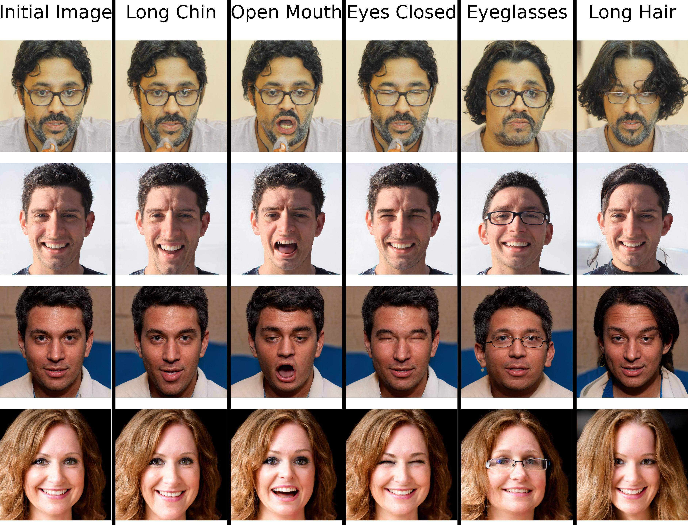
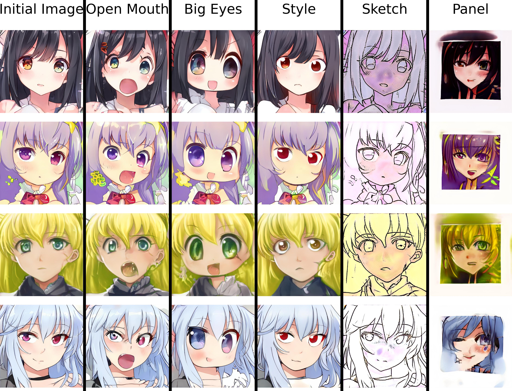

# Introduction

This repo contains the implementation of my B.sc. Thesis titled
**"MddGAN : Multilinear Analysis of the GAN Latent Space"**. The thesis
text can be found [here](https://pergamos.lib.uoa.gr/uoa/dl/object/3059772).

In short, this thesis proposes an unsupervised method to discover a wide range
of interpretable vector directions by analyzing the space of the generator's
parameters, otherwise known as the _GAN latent space_. The extracted directions
can then be exploited in order to produce impressive visual edits, on par with
the current SOTA methods. Furthermore, the proposed method does not only reveal
the explanatory factors learnt by the generator, but it also attempts to arrange
them along the dimensions of the produced multilinear basis, according to the
semantic content they encode.


# Sample Results

**StyleGAN2 FFHQ**




**StyleGAN AnimeFaces**



**Note:** Every image on the above charts is generated by the corresponding GAN
model, even the ones on the "Initial Image" column.

# Usage
To replicate the exact environment used during the development of this repo,
simply run:
```
pip install -r requirements.txt
```

## Discovering semantic concepts in the GAN latent space
### Basic Execution
```
python discover_semantics.py [model_name] [method_name]
```
where `model_name` refers to the name of the GAN model you want to discover
semantics for and `method_name` refers to the method to use when analyzing
the latent space of the selected GAN model. The list of valid `model_name`'s
to use can be found at [mddgan/models/model_zoo.py](models/model_zoo.py),
while `method_name` can be either one of `mddgan`, `sefa` or `both`.

For instance, some sample executions are:

```
# Analyze StyleGAN2 FFHQ model
python discover_semantics.py stylegan2_ffhq1024 [method_name]

# Analyze StyleGAN LSUN Bedroom model
python discover_semantics.py stylegan_bedroom256 [method_name]

# Analyze ProGAN CelebaHQ model
python discover_semantics.py pggan_celebahq1024 [method_name]
```

### Analyzing Specific Layer Ranges
Note that in the case of **StyleGAN/StyleGAN2** models, e.g `stylegan2_ffhq1024` and
`stylegan_bedroom256` from above, the default behaviour of the program is to analyze
_all layers_ of the selected model, which will discover directions
that impact multiple variation factors at once. However, this behaviour can be modified by
using the `layer_range` option. For example, to extract semantics that effect the overall
geometric properties of the image, you probably want to target the initial layers:

```
python discover_semantics.py stylegan2_car512 [method_name] --layer_range 0-3
```
In general, the argument to `layer_range` indicates the layer indices of
the model to analyze and is of the form: $idx_{1} - idx_{2}$, where
$idx \in [0, L - 1]$. Here, $L$ is denoting the total number of layers in $G$,
and for ProGAN/StyleGAN/StyleGAN2 models that synthesize $1024 \times 1024$
resolution images, $L = 18$.

### Attempting to Group the Discovered Semantics
Other than simply discovering surprising directions, MddGAN can additionally
separate them into groups. In essence, by tensorizing the produced multilinear
basis $\mathcal{\mathbf{B}}$, one can attempt to gather all directions encoding
the same variability factor by slicing tensor $\mathcal{\mathbf{B}}$ on the
appropriate mode (dimension). To achieve this, we can use the `num_modes` option.
The argument to `num_modes` sets the estimated number of variation factors the
Generator has learnt to model. For instance, assuming 3 modes of variation:

```
python discover_semantics.py stylegan2_car512 mddgan --num_modes 3
```

### Reducing the Number of Discovered Directions
Finally, to discover a reduced number of directions, the `num_components`
option can be used. For instance, to discover 200 directions instead of
the default 512, run:

```
python discover_semantics.py stylegan2_car512 mddgan --num_components 200
```

### Selecting the Editing Magnitude
talk about the magnitude of the edit `start_distance` and `end_distance`.

## Evaluation
### FID Scores
In the directory [mddgan/fid_files](fid_files), we provide some pre-computed
FID scores, calculated by editing synthesized images using directions that
impact distinctive facial attributes (pose, gender, age, smile, eyeglasses).

For example, to plot the FID scores for the pose discovered attribute and for
the StyleGAN CelebaHQ model, comparing MddGAN to InterFaceGAN, run:

```
python plot_fid.py stylegan_celebahq1024 interfacegan pose
```

The program will locate the corresponding file, in this case the file is 
[mddgan/fid_files/stylegan_celebahq1024_interfacegan_pose.txt](fid_files/stylegan_celebahq1024_interfacegan_pose.txt),
gather the FID scores and produce the corresponding plot.

### Correlation Between Discovered Attributes 
Based on prior work, we know that some of the semantics discovered by
unsupervised methods (and not only) might be coupled with each other.
For instance, the _eyeglasses_ direction is frequently correlated with
_gender_ and _age_, because in the respective training datasets (e.g CelebaHQ,
FFHQ), people that wear eyeglasses are usually older males.

To measure the correlation between 2 discovered facial attributes, we use
cosine similarity.

```
python cosine_similarity.py [model_name] [method_name]
```

The above will compute the correlation between the discovered attributes and
produce a correlation matrix.


## Google Colab Notebooks
The code of this repo requires a machine with an Nvidia GPU to run (with the exception of `cosine_similarity.py`
and `plot_fid.py`) .
However, if you don't have one available, you can still run the following Google Colab notebooks to
recreate the figures present in the thesis:
* Figure 4.2 : `layer_ranges_chart.ipynb` -> [Colab link](https://colab.research.google.com/github/lazavgeridis/mddgan/blob/main/notebooks/layer_ranges_chart.ipynb)
* Figures 4.3-4.4 and 4.6-4.11 : `interpolation_across_each_mode.ipynb` -> [Colab link](https://colab.research.google.com/github/lazavgeridis/mddgan/blob/main/notebooks/interpolation_across_each_mode.ipynb)
* Figure 5.1-5.2 and 5.4 : `mddgan_comparisons_v1.ipynb` -> [Colab link](https://colab.research.google.com/github/lazavgeridis/mddgan/blob/main/notebooks/mddgan_comparisons_v1.ipynb)
* Figure 5.3 : `diversity_of_discovered_semantics.ipynb` -> [Colab link](https://colab.research.google.com/github/lazavgeridis/mddgan/blob/main/notebooks/diversity_of_discovered_semantics.ipynb)


# Acknowledgements
This project could not exist if it weren't for the excellent implementations
listed below:
* The [SeFa](https://github.com/genforce/sefa) project, from which a substantial
part of the code of this project is inspired. The [mddgan/models](models)
directory used here is borrowed from SeFa.
* The [InterFaceGAN](https://github.com/genforce/interfacegan) project, from
which we borrow the ProGAN and StyleGAN directions used in our comparisons.
* The [GANLatentDiscovery](https://github.com/anvoynov/GANLatentDiscovery)
project, from which we got the inspiration for the core visualization operation
implemented here.
