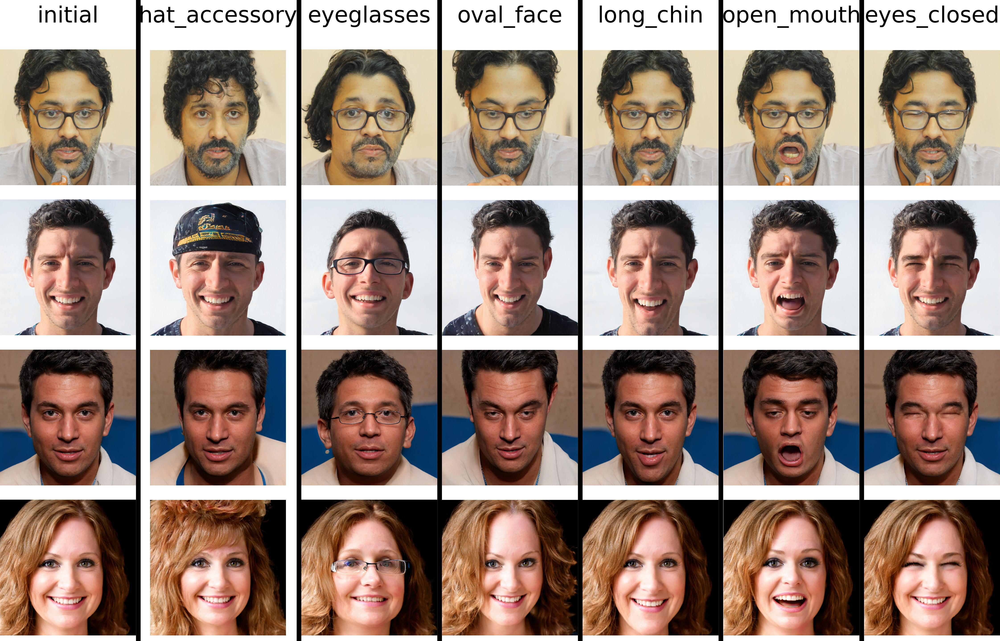

# Introduction

This repo contains the implementation of my Bsc Thesis titled
"MddGAN : Multilinear Analysis of the GAN Latent Space". The thesis
text can be found [here](https://pergamos.lib.uoa.gr/uoa/dl/object/3059772).

# Results

|           | initial image                       | attribute 1 | attribute 2 | attribute 3 |
| --------- | -------------                       | ----------- | ----------- | ----------- |
| sample 1  |  |             |             |             |
| sample 2  |                                     |             |             |             |
| sample 3  |                                     |             |             |             |

*StyleGAN2 FFHQ*

